# Board Game Complexity Analysis
Data Science Course Projects

**Executive Summary**

The Apprentice assumed the role of a designer interested in producing a new board game. Stakeholders are senior designers within a fictitious business, interested in making the most appealing game possible. They’re concerned games perceived to be ‘too complex’ may be less appealing. Understanding the relationship between perceived complexity and audience reception is key when producing a desirable product. 

Data from BoardGameGeek.com (BGG) was loaded into Python for analysis. It featured details on board game categories, among other characteristics. 

It was hypothesised that increasing complexity would raise user ratings to a point, before reducing when too much complexity detracted from user appeal. 

Linear regression was used to evaluate the relationship between two numeric fields, User Ratings and ‘GameWeight’, a user-defined measure of perceived complexity. Initially intended to provide a preliminary understanding before pursuing more complex approaches, such as polynomial regression, the technique was retained when the two variables shared a positive relationship without the expected reduction in ratings, meaning it was deemed fit-for-purpose.  

For each increase in complexity by 1, the median user rating increased by 0.53 (out of 5). An R-squared score of 0.4 indicated 40% of the variation in the test data was explained by the model’s predicted values. 

Further investigation indicated additional variation between categories of board game.

A line chart showing median complexity, user ratings and a regression trendline was produced in Power BI to present insights visually to stakeholders. A filter allows users to select different combinations of categories, dynamically update visuals, understand the impact on ratings, which will inform design decisions.

The game will be designed incrementally, testing features with focus groups periodically to receive feedback. Iterative changes can then be made before the product is released to the market, to optimise the user experience and drive more sales. 

The experiment could be further improved by including units owned, as a user’s perception of a game may not necessarily indicate they’re willing to purchase it.

**Introduction and Research**

Knowing where to pitch a game is difficult for designers, too complex and it may become exclusive, alienating audiences, too simple it may be considered dull. 

(Greenhalgh, Koehler and Boltz, 2019) identify three key components of an engaging game: theme, mechanics and genre. They discuss the interplay between these factors and how they affect ratings.

While informative, their experiment has two main flaws. Games were viewed with an educational, not commercial lens, so there is inherent prejudice on what defines a ‘well-made’ product. Considering 208 games out of 21,000 available in the BGG dataset also demonstrates selection bias.

For educational games they indicate a trade-off between user ratings and academic value. While a correlation between complexity and ratings may be observed in the Apprentice’s experiment, these should not be considered as the only factors for commercial success. Lower-rated games may still have commercial value and may make new markets available, e.g. educational products for schools. 

**Ethics & Bias**

The Data Ethics Framework was designed for the public sector, but its core values of Transparency, Accountability and Fairness directly transfer to this project (UK Government, 2020).

Legal and regulatory concerns, arising under the EU General Data Protection Regulation (GDPR) and the Data Protection Act 2018 (DPA 2018), were alleviated given the source contains no personal information. 

Game data is publicly available, but restrictions apply when used for commercial purposes. A license from the owner has been obtained for use in this academic exercise (BoardGameGeek, 2025).

The final dashboard mitigates cognitive and confirmation biases by allowing users to ‘mix-and-match’ game category combinations for optimal results, not just the preconceived ideas of what designers believe success looks like.

**ETL-Production**

An overview of Data Scientist (DS) interactions, the ETL (Extract, Transform, Load) pipeline and how this could be put into production is illustrated in Fig.1.

**Fig.1**

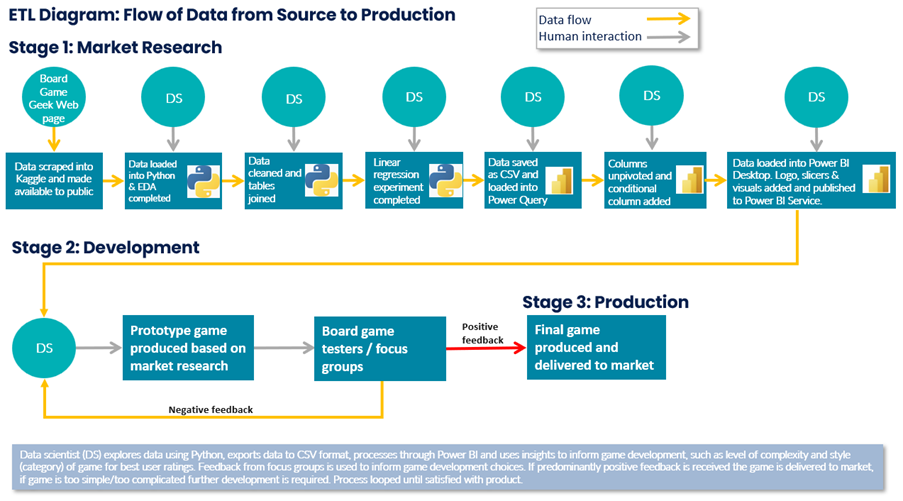

Data was explored using Python to leverage its superior analytical capabilities, compared with other applications such as Excel. It was then exported to a CSV file, processed through Power BI and presented to senior developers and focus groups.

Feedback informs development choices, such as the level of complexity, theme, category and genre. If this is sufficiently positive the product will be delivered to market, if it is too simple or too complicated, further development will be completed. The feedback process is looped until stakeholders are satisfied with the product.

Data was extracted from CSV files and loaded into python (Fig.2).

**Fig.2**

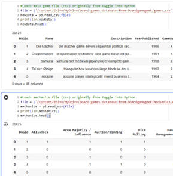

Fields were inspected for their Uniqueness, Consistency, Timeliness, Validity, Accuracy and Completeness, defined under ‘The Government Data Quality Framework’ (UK Government, 2025). Null values were identified, but these weren’t relevant to this experiment so no transformations were required (Fig.3).
 
**Fig.3**

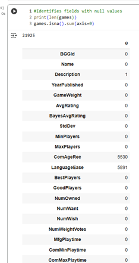

A left join merged the game dataset with another dataset, which provided more categorical fields, required for filtering the final dashboard (Fig.4).

**Fig.4**

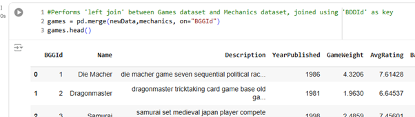

A scatter plot showed a positive trend between perceived complexity and user ratings. Values did not appear strongly correlated, given the number of outliers (Fig.5).

**Fig.5**

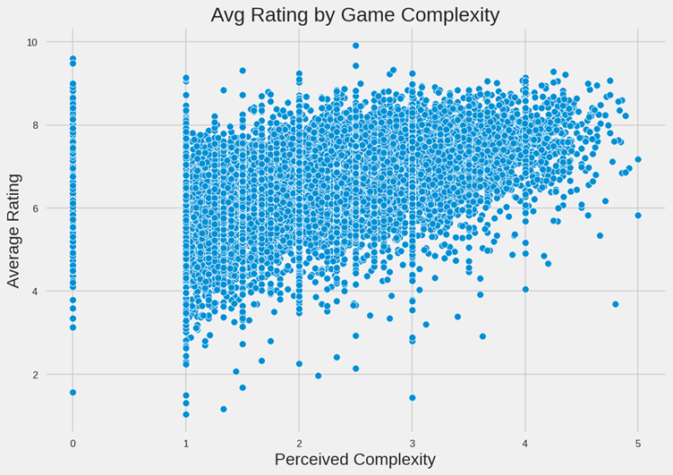

When viewed using a boxplot a trend is more apparent. The median and central fifty percent of values clearly show increases in user ratings as game complexity rises (Figs.6,7). 

**Fig.6**

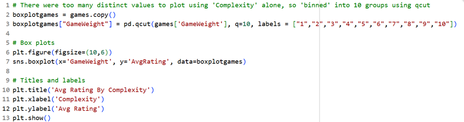

**Fig.7**

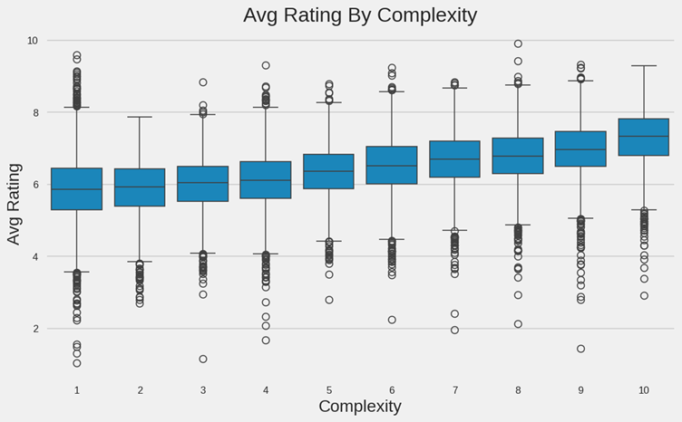

**The Experiment**

A linear regression experiment was completed to test how well predictions made using ‘training’ data fit actual results in ‘test’ data (Mendoza, 2022).

**Fig.8**

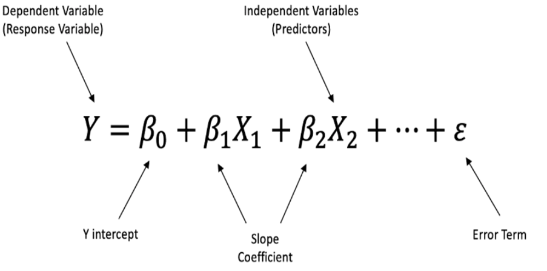
 
Y values represent dependent variables, user ratings; each X value represents the independent variable, complexity (‘GameWeight’). Beta values represent slope coefficients (Fig.8). 

Data was split into two groups, a random seed of 80% to train the model and the remaining 20% to test the prediction.

Given the level of variance for each ‘GameWeight’ score, these have been grouped by the median of each value, making it easier to observe trends (Figs.9,10).

**Fig.9**

 
**Fig.10**

A line chart shows movements in median rating by complexity, with the purple trend derived through linear regression (Fig.11).

**Fig.11**

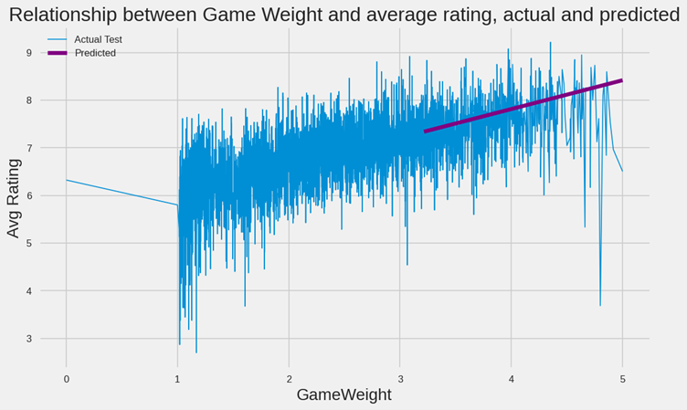

**Fig.12**

 
**Fig.13**

 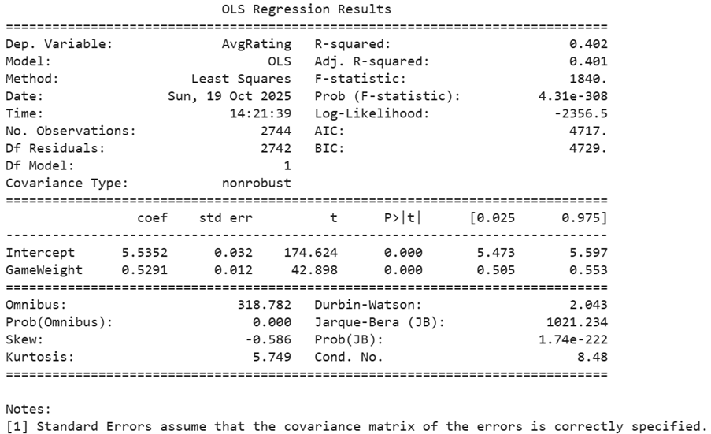
 
Beta-zero (Y-intercept) was an average user rating of 5.5 out of 10, with ratings increasing by 0.53 for each increase in the ‘GameWeight’ by 1 (Figs.12,13).

R-Squared was used to measure how well the prediction fits with actual results in test data.
•	SSRes: ‘…the sum of the square of the distance between the actual point and the predicted point in the best-fit line.’
•	SSTot: ‘…the sum of the Square of the distance between the actual point and the mean of all the points in the mean line.’ (Gultekin, 2025).

**Fig.14**

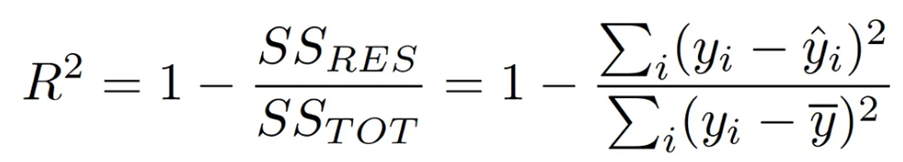
 
R-squared equaled 0.4, indicating the regression didn’t fit the test data well, but given the context the experiment still has some utility for game designers (Fig.14). 

**Fig.15**

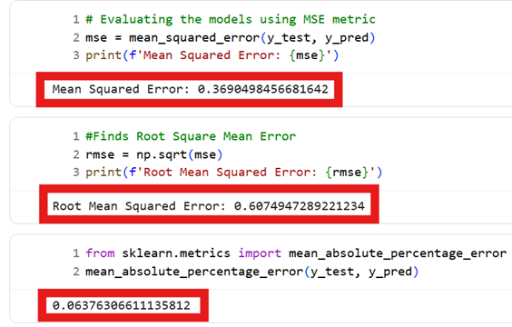
 
To explore whether further variation existed between game categories, a function was defined to derive the correlation coefficient between complexity and rating, which was ‘looped’ through each category (Fig.16). 

**Fig.16**

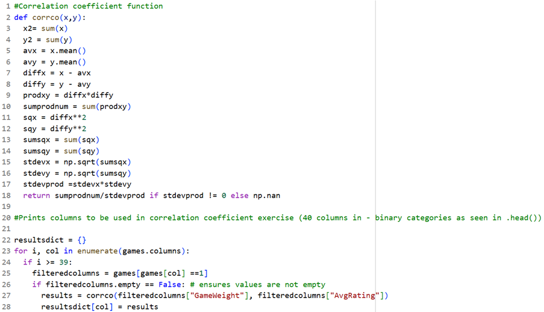

Categories were ranked by their coefficients, largest to the smallest (Figs.17,18).

**Fig.17**

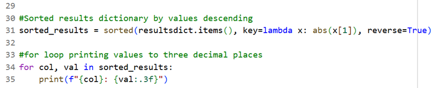
 
**Fig.18**

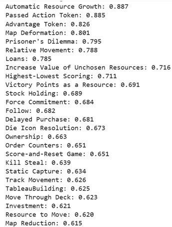
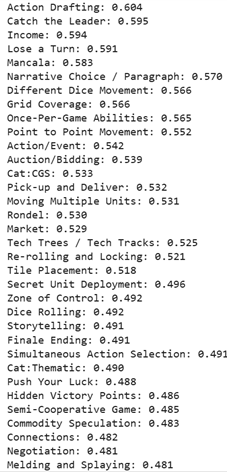
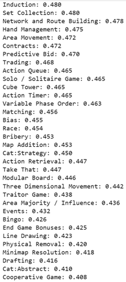
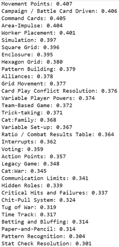

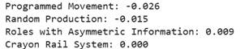

The range in coefficients indicated varying strengths of relationship between the two variables. 

**Dashboard & Visuals**

Data was loaded into Power BI using the CSV connector (Figs.19,20).

**Fig.19**

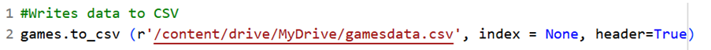

**Fig.20**

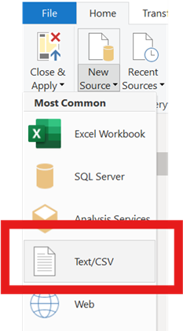

Data was loaded into the dashboard. A dynamic table grouped ratings by complexity ‘bins’, allowing users to quantify insights (Fig.21).

**Fig.21**

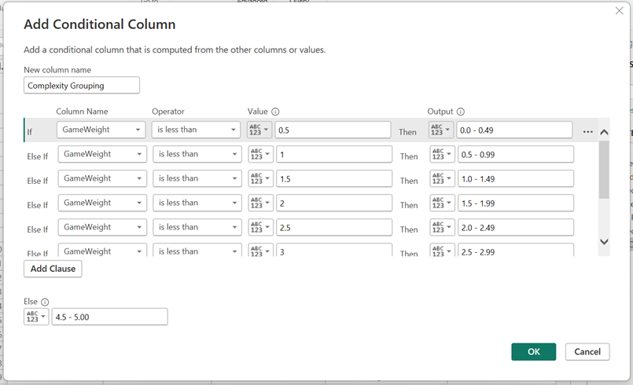

A business logo and a title were added to connect theme with branding.

**Fig.22**

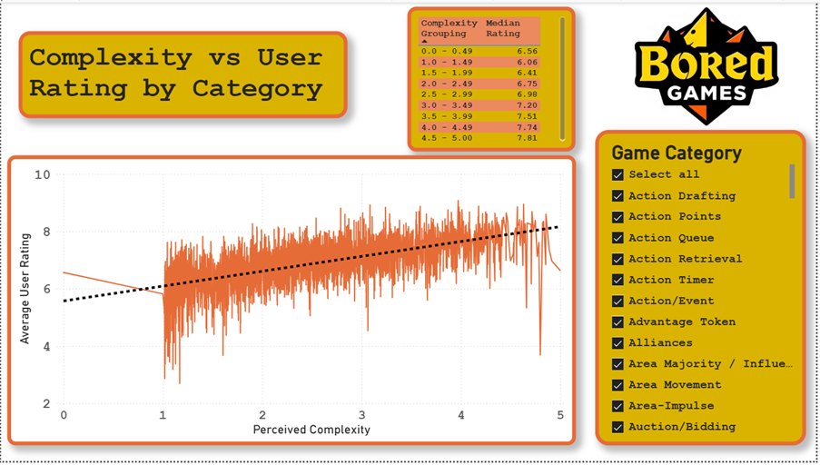

A line chart shows stakeholders how complexity affects user ratings (Fig.22). 

A trendline replicates the linear regression previously produced in Python. The format makes it easy for users to move their cursor over the chart and view a predicted rating for any level of complexity. 

A slicer filters the chart and trendline dynamically, enabling designers to derive category specific insights.

**Conclusions **

An R-squared score of 0.4 and a regression coefficient of 0.53 enabled designers to predict how users will react to game complexity. Contrary to the initial hypothesis there was no observed ‘dip’ in ratings for more complex games. 

While actual ratings may deviate from the experiment’s predicted values, both ‘complexity’ and ‘ratings’ attempt to quantify subjective opinions, something which is inherently volatile within a population. The ‘general trend’ however, is still of commercial value. Users can select and quantify how combinations of categories affect ratings, which is important to game developers when looking to make the most appealing product, a key component of commercial success. 

In the future, the ‘number of units owned’ metric should be considered to estimate future sales volumes and indicate the viability of future projects. 

**Bibliography**

•	Samarasinghe, D., 2021. BoardGameGeek Dataset on Board Games. IEEE DataPort. [online] Available at: https://doi.org/10.21227/9g61-bs59 [Accessed 15 October 2025]
•	Greenhalgh, S.P., Koehler, M.J. and Boltz, L.O. 2019. The Fun of Its Parts: Design and Player Reception of Educational Board Games – CITE Journal. [online] Available at: https://citejournal.org/volume-19/issue-3-19/general/the-fun-of-its-parts-design-and-player-reception-of-educational-board-games/ [Accessed 30 October 2025]
•	Rossi, F.S. et al., 2025. From glitter to gold: recommendations for effective dashboards from design through sustainment. Implementation Sci, 20,16., doi: https://doi.org/10.1186/s13012-025-01430-x [Accessed 27 October 2025]
•	GOV.UK, 2018. Data Protection Act 2018. [online] legislation.gov.uk. Available at: https://www.legislation.gov.uk/ukpga/2018/12/contents [Accessed 2 November 2025]
•	Matplotlib.org. (n.d.). Colormap reference — Matplotlib 3.5.2 documentation. [online] Available at: https://matplotlib.org/stable/gallery/color/colormap_reference.html [Accessed 17 October 2025]
•	GeeksforGeeks, 2020. Export Pandas dataframe to a CSV file. [online] GeeksforGeeks. Available at: https://www.geeksforgeeks.org/python/export-pandas-dataframe-to-a-csv-file [Accessed 15 October 2025]
•	pandas.pydata.org. (n.d.). Merge, join, concatenate and compare — pandas 1.2.4 documentation. [online] Available at: https://pandas.pydata.org/docs/user_guide/merging.html [Accessed 22 October 2025]
•	Waskom, M., 2024. Seaborn.boxplot — seaborn 0.11.1 documentation. [online] seaborn.pydata.org. Available at: https://seaborn.pydata.org/generated/seaborn.boxplot.html [Accessed 15 October 2025]
•	BoardGameGeek, 2025. Weight. [online] Available at: https://boardgamegeek.com/wiki/page/Weight [Accessed 15 October 2025]
•	www.w3schools.com, (n.d.). Matplotlib Labels and Title. [online] Available at: https://www.w3schools.com/python/matplotlib_labels.asp [Accessed 20 October 2025]
•	Google, 2024. Linear regression. [online] Google for Developers. Available at: https://developers.google.com/machine-learning/crash-course/linear-regression [Accessed 22 October 2025]
•	GeeksforGeeks (n.d.) Pandas groupby and computing median. Available at: https://www.geeksforgeeks.org/python/pandas-groupby-and-computing-median/ [Accessed 21 October 2025]
•	Amit, H., 2025. Ways to use pandas move index to column. Medium. Available at: https://medium.com/@heyamit10/ways-to-use-pandas-move-index-to-column-8d507b2b0795 [Accessed 16 October 2025]
•	Analytics Vidhya, 2025. R-squared formula explanation. Medium. Available at: https://medium.com/analytics-vidhya/r-squared-formula-explanation-6dc0096ce3ba [Accessed 1 November 2025]
•	UK Government, 2025. The Government Data Quality Framework. Available at: https://www.gov.uk/government/publications/the-government-data-quality-framework/the-government-data-quality-framework#Data-Quality-Principles [Accessed 2 November 2025]
•	IEEE, 2021. Document 9509022. Available at: https://ieeexplore.ieee.org/document/9509022 [Accessed 20 October 2025]
•	Reese, L., 2025. Power BI dashboard design best practices guide. Available at: https://lukasreese.com/2025/08/20/power-bi-dashboard-design-best-practices-guide/ [Accessed 15 October 2025]
•	Color Blindness (n.d.) Coblis – Color blindness simulator. Available at: https://www.color-blindness.com/coblis-color-blindness-simulator/ [Accessed 21 October 2025]
•	Gultekin, H., 2025. What is silhouette score?. Medium. Available at: https://medium.com/@hazallgultekin/what-is-silhouette-score-f428fb39bf9a [Accessed 3 November 2025]
•	Six Sigma DSI (n.d.) Multiple regression line. Available at: https://sixsigmadsi.com/multiple-regression-line/ [Accessed 22 October 2025]
•	CITE Journal, 2019. The fun of its parts: Design and player reception of educational board games. Available at: https://citejournal.org/volume-19/issue-3-19/general/the-fun-of-its-parts-design-and-player-reception-of-educational-board-games/ [Accessed 15 October 2025]
•	Google for Developers, 2025. Advantages and disadvantages of k-means. [online] Available at: https://developers.google.com/machine-learning/clustering/kmeans/advantages-disadvantages?_gl=1 [Accessed 4 Dec. 2025]
•	GOV.UK, 2020. Data Ethics Framework. [online] Available at: https://www.gov.uk/government/publications/data-ethics-framework/data-ethics-framework-2020 [Accessed 4 Dec. 2025]
•	BoardGameGeek, 2025. BGG XML API Commercial Use. [online] Available at: https://boardgamegeek.com/wiki/page/BGG_XML_API_Commercial_Use [Accessed 4 Dec. 2025]
•	IBM, 2024. Data Bias. [online] Ibm.com. Available at: https://www.ibm.com/think/topics/data-bias [Accessed 4 Dec. 2025]

Board game data provided compliments of BoardGameGeek: 

